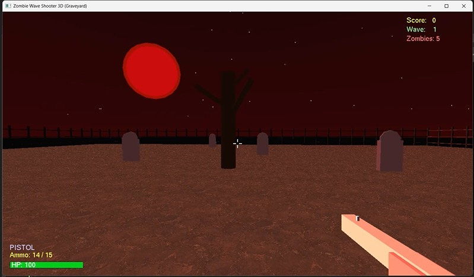
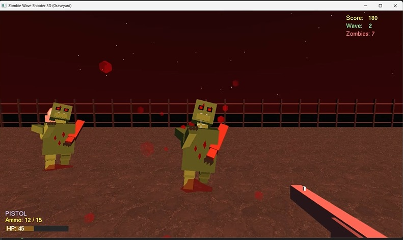
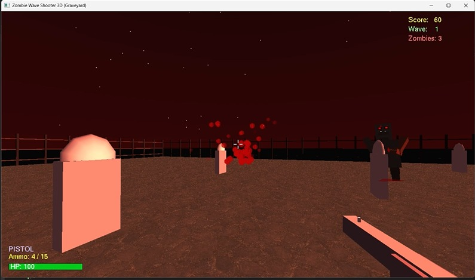

# Zombie Wave Shooter 3D

A simple 3D zombie shooter game developed using C++ and OpenGL.

## Features
- 3D zombie enemies
- Shooting mechanics
- Wave and score system
- Health and ammo system
- Graveyard environment
- Basic collision detection

## Technologies Used
- C++
- OpenGL
- GLUT

## Screenshots

### Gameplay

### Zombie Close-up

### Shooting Effect

## How to Run
1. Open the project using Visual Studio
2. Build the solution
3. Run the project

## Controls
- WASD → Move
- Mouse → Aim
- Left Click → Shoot
